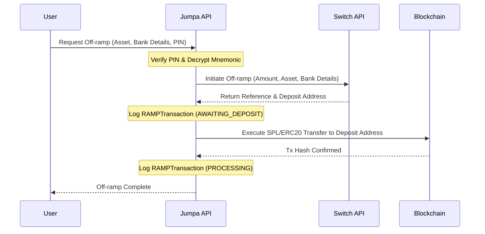

# 🔄 Switch Stablecoin Bridge Integration Guide

This document provides a detailed overview of the **Switch Integration** within Jumpa, detailing the API interactions, supported networks/currencies, transaction lifecycles, and developer fee monetization features based on the [Switch Documentation](https://switch-3.gitbook.io/api).

---

## 📌 Table of Contents
1. [Overview](#-overview)
2. [Supported Assets & Fiat Currencies](#-supported-assets--fiat-currencies)
   - [Supported Stablecoins](#supported-stablecoins)
   - [Supported Fiat Currencies](#supported-fiat-currencies)
3. [On-Ramp Integration](#-on-ramp-integration)
   - [On-Ramp Quote](#1-get-on-ramp-quote)
   - [On-Ramp Initiation](#2-initiate-on-ramp-transaction)
4. [Off-Ramp Integration](#-off-ramp-integration)
   - [Off-Ramp Quote](#1-get-off-ramp-quote)
   - [Off-Ramp Initiation & Automation](#2-initiate-off-ramp-transaction)
5. [Developer Fee Collection & Withdrawal](#-developer-fee-collection--withdrawal)
   - [Collecting Fees](#1-collecting-fees)
   - [Checking Fee Balance](#2-checking-collected-fees)
   - [Withdrawing Fees](#3-withdrawing-accumulated-fees)

---

## 🌐 Overview

Switch is a stablecoin-to-local-currency gateway enabling low-latency conversion between fiat bank transfers and crypto assets. The integration in Jumpa consists of two core components:

*   **[`lib/switch.ts`](file:///Users/test/Desktop/PROJECTS/2026apr/jumpa-private/lib/switch.ts)**: A type-safe client wrapping Switch endpoints (`https://api.onswitch.xyz`).
*   **[`app/api/offramp/initiate/route.ts`](file:///Users/test/Desktop/PROJECTS/2026apr/jumpa-private/app/api/offramp/initiate/route.ts)**: An automated off-ramp pipeline that initiates conversions and executes blockchain transfers directly from the user's secure wallet.

---

## 💱 Supported Assets & Fiat Currencies

Asset identifiers follow the format `<blockchain>:<asset>` (e.g., `base:usdc`).

### Supported Stablecoins
The bridge currently supports the following network-specific stablecoin pairs:

| Asset Identifier | Asset Name | Network |
| :--- | :--- | :--- |
| `base:usdc` | USD Coin | Base |
| `base:cngn` | cNGN | Base |
| `solana:usdc` | USD Coin | Solana |
| `solana:usdt` | Tether USDT | Solana |
| `ethereum:usdc` | USD Coin | Ethereum |
| `ethereum:usdt` | Tether USDT | Ethereum |
| `polygon:usdc` | USD Coin | Polygon |
| `polygon:usdt` | Tether USDT | Polygon |
| `bsc:usdc` | USD Coin | BNB Smart Chain |
| `bsc:usdt` | Tether USDT | BNB Smart Chain |
| `bsc:cngn` | cNGN | BNB Smart Chain |
| `arbitrum:usdc` | USD Coin | Arbitrum |
| `arbitrum:usdt` | Tether USDT | Arbitrum |
| `optimism:usdc` | USD Coin | Optimism |
| `optimism:usdt` | Tether USDT | Optimism |
| `avalanche:usdc` | USD Coin | Avalanche |
| `avalanche:usdt` | Tether USDT | Avalanche |
| `gnosis:usdc` | USD Coin | Gnosis Chain |
| `gnosis:usdt` | Tether USDT | Gnosis Chain |
| `tron:usdt` | Tether USDT | TRON |
| `assetchain:usdc` | USD Coin | AssetChain |
| `assetchain:usdt` | Tether USDT | AssetChain |
| `monad:usdc` | USD Coin | Monad |
| `monad:usdt` | Tether USDT | Monad |
| `linea:usdc` | USD Coin | Linea |
| `linea:usdt` | Tether USDT | Linea |
| `berachain:usdc` | USD Coin | Berachain |
| `berachain:usdt` | Tether USDT | Berachain |
| `sonic:usdc` | USD Coin | Sonic |
| `plasma:usdt` | Tether USDT | Plasma |
| `bitcoin:btc` | Bitcoin | Bitcoin |

### Supported Fiat Currencies
Switch covers global jurisdictions. Common examples include:
*   **`NGN`** (Nigerian Naira - primary rail for NIBSS/BANK channels)
*   **`USD`** (US Dollar)
*   **`EUR`** (Euro)
*   **`GBP`** (British Pound)
*   **`GHS`** (Ghanaian Cedi)
*   **`KES`** (Kenyan Shilling)
*   *Full list includes 100+ standard fiat codes such as CAD, AUD, ZAR, BRL, and INR.*

---

## 📈 On-Ramp Integration

Converting local fiat currency into stablecoins deposited directly into a user's Web3 wallet address.

### 1. Get On-Ramp Quote
Fetch an active quote mapping the input fiat amount to expected crypto tokens.

*   **Endpoint:** `POST /onramp/quote`
*   **Method:** `SwitchService.getQuote(amount, asset, isExactOut)`

#### Payload Structure:
```json
{
  "amount": 10000,
  "country": "NG",
  "currency": "NGN",
  "asset": "base:usdc",
  "rail": "NIBSS",
  "exact_output": false,
  "developer_fee": 1.5,
  "developer_recipient": "0x123...abc"
}
```

### 2. Initiate On-Ramp Transaction
Creates a transaction record and returns the bank details or routing actions required to settle the payment.

*   **Endpoint:** `POST /onramp/initiate`
*   **Method:** `SwitchService.initiateOnRamp(amount, asset, walletAddress, isExactOut)`

#### Response Payload (`200 OK`):
```json
{
  "success": true,
  "status": 200,
  "message": "Onramp initiated successfully",
  "data": {
    "deposit": {
      "bank_name": "Providus Bank",
      "bank_code": "101",
      "account_name": "Jumpa Custody Client",
      "account_number": "1234567890",
      "note": ["Include transaction reference"]
    },
    "reference": "d3b07384-d113-4950-9321-49938b8e05cc",
    "destination": {
      "amount": 6.54,
      "currency": "USDC"
    }
  }
}
```

> [!NOTE]
> The beneficiary user makes a manual domestic transfer (e.g., NIBSS instant transfer in Nigeria) using the bank details returned in the response.

---

## 📉 Off-Ramp Integration

Converting stablecoins inside a Web3 wallet into local fiat currency deposited directly into a bank account.

### 1. Get Off-Ramp Quote
Fetch exchange rates, network fees, and destination fiat settlement amount.

*   **Endpoint:** `POST /offramp/quote`
*   **Method:** `SwitchService.getOfframpQuote(amount, asset, isExactOut)`

### 2. Initiate Off-Ramp Transaction
Off-ramping is fully automated inside the Jumpa api handler.

*   **Endpoint:** `POST /offramp/initiate`
*   **Method:** `SwitchService.initiateOfframp(amount, asset, beneficiary, isExactOut)`

#### Jumpa Flow Pipeline:


#### Automated Settlement Logic:
During initiation, the backend retrieves the user's decrypted seed and executes the required Web3 transfer payload:
*   **Solana (`solana:usdc` / `solana:usdt`):** Spawns a token transaction targeting Switch's generated deposit address via `@solana/spl-token`'s `createTransferInstruction`.
*   **Base (`base:usdc`):** Initiates a standard ERC20 `transfer` contract call using `viem` clients.

---

## 💰 Developer Fee Collection & Withdrawal

Switch offers platform monetization mechanics by allowing developers to set margins on every user exchange.

### 1. Collecting Fees
During `/onramp/quote`, `/onramp/initiate`, `/offramp/quote`, or `/offramp/initiate` calls, specify your fee percentages and settlement addresses:

*   **`developer_fee`** (number): A percentage margin (e.g. `1.0` for 1%) to add to the base exchange rate.
*   **`developer_recipient`** (string): The public wallet address where the fee allocation will compile.

### 2. Checking Collected Fees
Retrieve a summary of collected developer fees available for withdrawal.

*   **Endpoint:** `GET /developer/fees`
*   **Method:**
```typescript
const response = await fetch("https://api.onswitch.xyz/developer/fees", {
  method: "GET",
  headers: {
    "x-service-key": process.env.SWITCH_LIVE_KEY || "",
    "Content-Type": "application/json"
  }
});
const result = await response.json();
```

#### Response Structure:
```json
{
  "success": true,
  "message": "Successfully retrieved collected fees",
  "timestamp": "2026-06-15T02:15:00.000Z",
  "data": {
    "amount": 142.85,
    "currency": "USDC"
  }
}
```

### 3. Withdrawing Accumulated Fees
Triggers an automated payout of accumulated fee assets to the specified developer payout address.

*   **Endpoint:** `POST /developer/withdraw`
*   **Method:**
```typescript
const response = await fetch("https://api.onswitch.xyz/developer/withdraw", {
  method: "POST",
  headers: {
    "x-service-key": process.env.SWITCH_LIVE_KEY || "",
    "Content-Type": "application/json"
  },
  body: JSON.stringify({
    "asset": "base:usdc",
    "beneficiary": {
      "wallet_address": "0xYourDevPayoutAddress"
    }
  })
});
```

> [!TIP]
> If you withdraw in a different asset from the collected base currency (USDC), Switch will automatically swap it during the payout route.

#### Response Structure:
```json
{
  "success": true,
  "message": "Successfully initiated fee withdrawal",
  "timestamp": "2026-06-15T02:16:00.000Z",
  "data": {
    "hash": "0x4e6b2...cf83",
    "explorer_url": "https://basescan.org/tx/0x4e6b2...cf83",
    "amount": 142.85
  }
}
```
