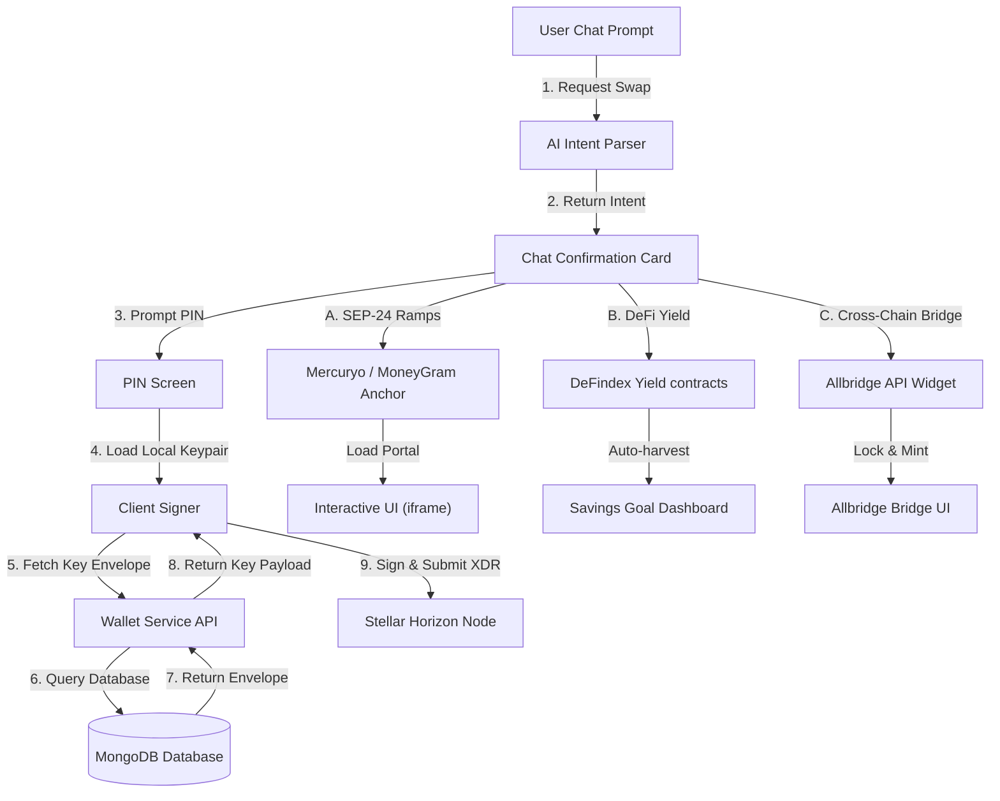
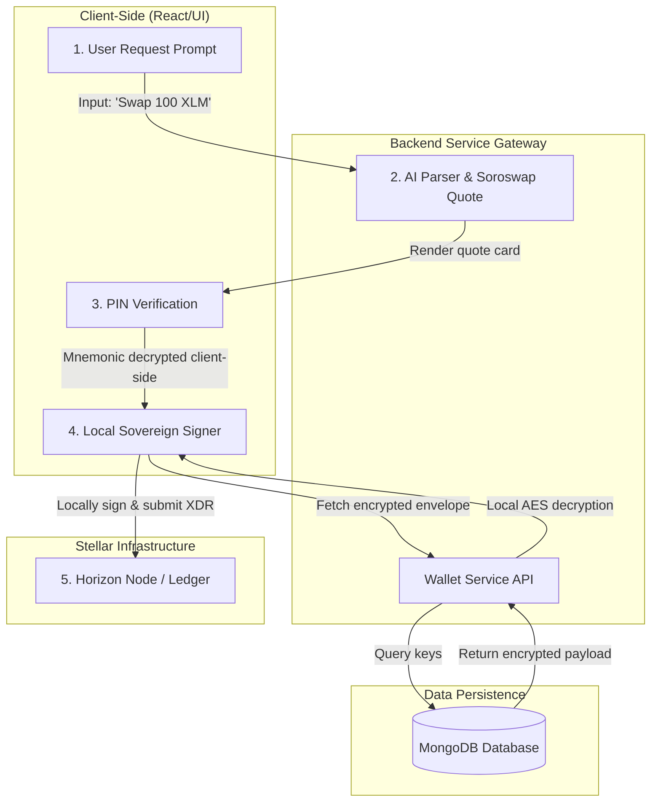
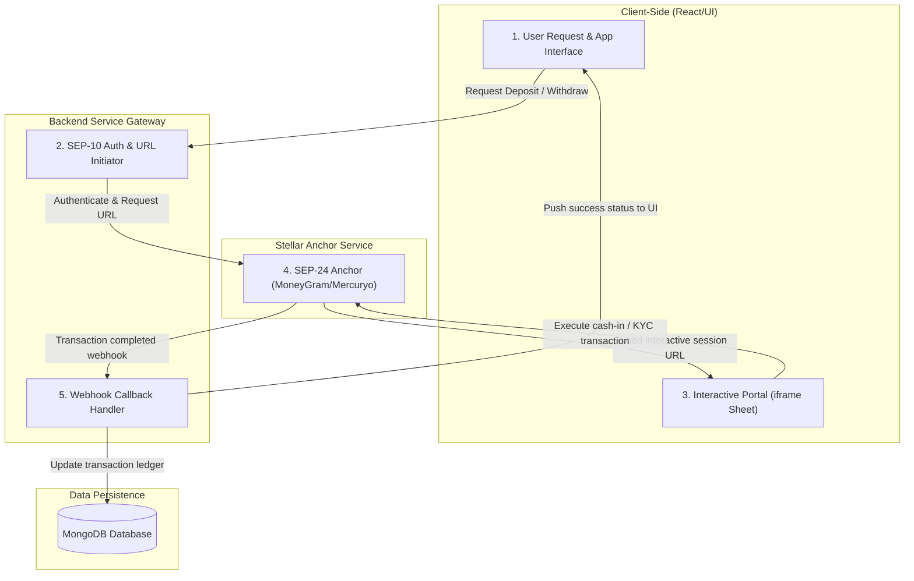
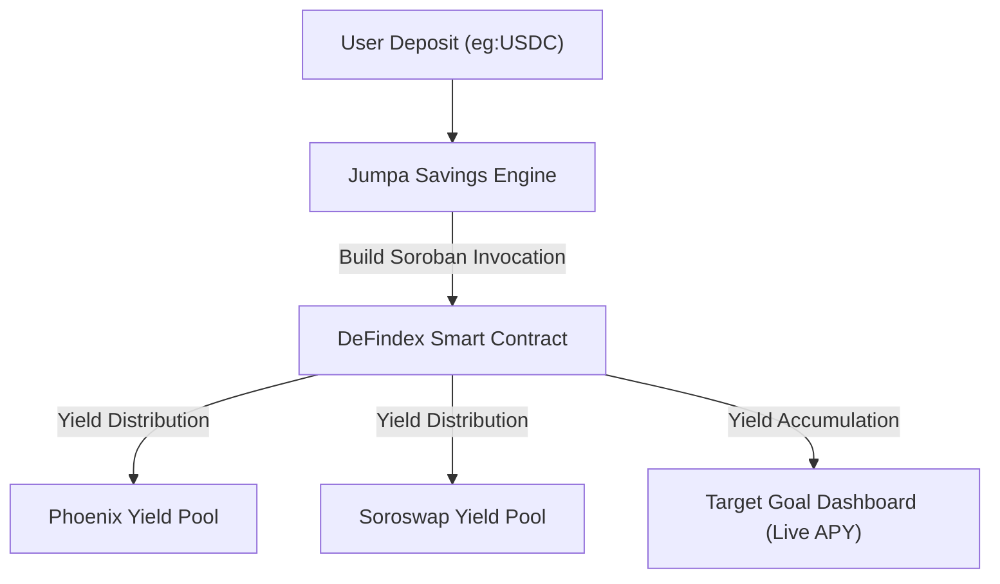
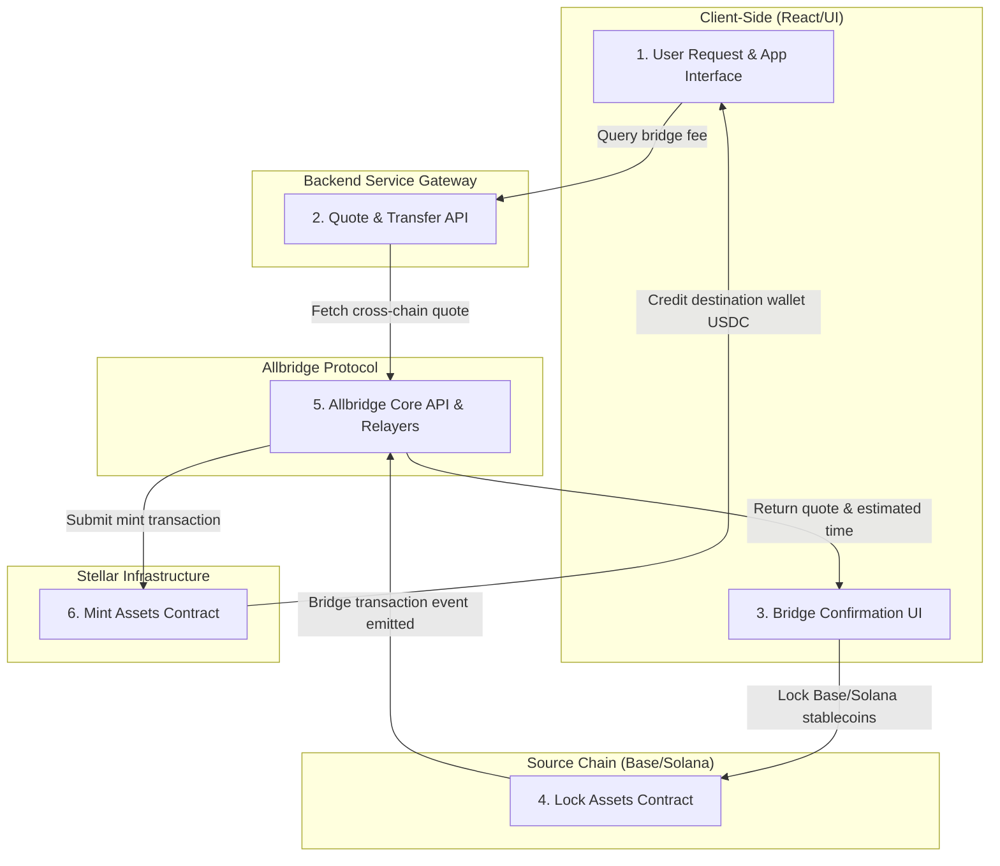

# Jumpa × Stellar: Technical Architecture
### Complete Integration Architecture for a Premium Chat-Native Multi-Chain Wallet & DeFi Gateway

---

## 1. System Architecture Overview

Jumpa is a premium, chat-native multi-chain wallet designed for emerging markets. It bridges the gap between traditional chat-native interfaces and complex Web3 protocols. At its core, Jumpa uses an **AI-powered Natural Language Processing (NLP)** loop to translate natural language inputs (e.g., *"Swap 100 XLM for USDC"* or *"Save $20 into my school fees goal"*) into structured blockchain transaction payloads.

The architecture is composed of a **Next.js App Router** frontend, a **Serverless TypeScript API** layer connected to **MongoDB** database, a **Sovereign Key Security Layer** executing cryptographic operations, and four dedicated **Stellar Integration Providers** communicating with Horizon Nodes, decentralized protocols, and cross-chain bridges.

### High-Level System Architecture Diagram



---

## 2. Integration Layer Architecture

The integration layer is built directly into Jumpa’s unified Next.js App Router structure. It separates reusable business logic (under `lib/stellar`), UI views/drawers (under `components/stellar`), and serverless API endpoints (under `app/api/stellar`).

### Directory Structure & Module Layout

```
lib/stellar/
├── client.ts             # Stellar SDK Horizon clients & network configurations
├── crypt.ts              # Client-side / Server-side cryptographic envelope utilities (AES-256-GCM)
├── soroswap.ts           # Soroswap REST API Client (Quotes, Route Aggregator, XDR Builder)
├── sep24.ts              # SEP-24 Anchor Client (MoneyGram, Mercuryo, SEP-10 JWT Auth)
├── defindex.ts           # DeFindex Smart Contract Client (Yield index pools & deposit routers)
└── allbridge.ts          # Allbridge SDK connector (Solana/Base-to-Stellar transaction builders)

components/stellar/
├── ChatInterface.tsx     # Conversational loop container with container queries
├── ConfirmationDrawer.tsx# Bottom drawer for PIN verification, gas abstraction status, & local signing
├── OnrampSheet.tsx       # SEP-24 on-ramp iframe loader with responsive fallback
├── OfframpSheet.tsx      # SEP-24 physical cash-out overlay
└── YieldDashboard.tsx    # Container-query driven flex grid card for DeFindex savings goals

app/api/stellar/
├── wallet/
│   ├── route.ts          # Standard wallet accounts status and synchronization
│   └── broadcast/
│       └── route.ts      # Horizon signed XDR transaction broadcasting endpoint
├── swap/
│   ├── quote/
│   │   └── route.ts      # Queries Soroswap Aggregator for prices & route optimization
│   └── build/
│       └── route.ts      # Builds unsigned transaction payload XDR for local signing
├── sep24/
│   ├── initiate/
│   │   └── route.ts      # Performs SEP-10 authentication & fetches interactive deposit/withdrawal URL
│   └── callback/
│       └── route.ts      # Webhook listener for anchor status changes (processing/completed)
├── yield/
│   ├── pools/
│   │   └── route.ts      # Retrieves available DeFindex yield-bearing liquidity indexes
│   ├── deposit/
│   │   └── route.ts      # Generates DeFindex deposit contract invocation XDR
│   └── stats/
│       └── route.ts      # Real-time yield performance calculator & APY aggregator
└── bridge/
    ├── quote/
    │   └── route.ts      # Fetches cross-chain transfer fees from Allbridge
    └── execute/
        └── route.ts      # Initiates cross-chain transaction flows from Solana/Base to Stellar
```

---

## 3. Soroswap Aggregator API Integration — Conversational Token Swaps

### 3.1 What Soroswap Does in Jumpa
Soroswap acts as the automated market-making (AMM) aggregator. Jumpa queries the **Soroswap Aggregator REST API** to automatically route swaps between stablecoins (e.g. USDC, USDT) and native assets (XLM) through the best paths across Soroswap pools, Phoenix DEX, and the classic Stellar Orderbook.

### 3.2 Conversational Swap Execution Flow



### 3.3 Soroswap API Integration Points

*   **Chat Core Engine (`app/api/ai/route.ts`)**: Integrates parsed entities to identify swap source asset, target asset, and volume.
*   **Soroswap Service (`lib/stellar/soroswap.ts`)**:
    *   `getSwapQuote(sellAsset: string, buyAsset: string, amount: string)`: Fetches price quotes from `https://api.soroswap.finance/api/v1/quote`.
    *   `buildSwapXDR(sourceAddress: string, sellAsset: string, buyAsset: string, amount: string, slippage: number)`: Connects to the `/build` endpoint to request raw unsigned XDR envelopes.
*   **Sign & Submit Controller (`app/api/stellar/wallet/broadcast/route.ts`)**: Broadcasts the locally signed envelope directly to the Horizon node network.

---

## 4. SEP-24 Hosted Ramps Integration — MoneyGram & Mercuryo

### 4.1 What SEP-24 Does in Jumpa
To eliminate banking rail friction in Sub-Saharan Africa and Southeast Asia, Jumpa integrates **Stellar Standard SEP-24 (Hosted Deposit & Withdrawal)**.
*   **MoneyGram Access**: Enables cash-in/cash-out via cash at physical MoneyGram agent locations.
*   **Mercuryo**: Enables bank cards and instant debit-card purchases of stablecoins directly.

### 4.2 Interactive Ramping Flow Architecture



### 4.3 SEP-24 Integration Points

*   **Responsive Iframe Sheet (`components/stellar/OnrampSheet.tsx`)**: Responsive, container-query styled drawer that embeds the anchor interactive session. Styled cleanly with border-radius overlays.
*   **Anchor API Wrapper (`lib/stellar/sep24.ts`)**:
    *   `authenticateSEP10(anchorDomain: string)`: Handles the two-way cryptographically signed challenge response protocol using the user's localized Stellar keypair to fetch the JWT.
    *   `getInteractiveUrl(jwt: string, asset: string, type: 'deposit' | 'withdraw')`: Requests interactive session configurations.
*   **Mongoose Ledger sync (`app/api/stellar/sep24/callback/route.ts`)**: Recovers webhook events from anchors to transitions `RampTransaction` states from `AWAITING_DEPOSIT` to `COMPLETED` and trigger system notification logs.

---

## 5. DeFindex Yield Infrastructure Integration — Target Savings Goals

### 5.1 What DeFindex Does in Jumpa
Emerging market users suffer from high inflation. Keeping static savings compounds money loss. Jumpa solves this by routing savings directly into **DeFindex (Yield Infrastructure for Stellar)** index tokens and liquidity pools. Deposits grow safely by harvesting real-time yields in stablecoins, preserving purchase power.

### 5.2 DeFindex Yield Savings Flow



### 5.3 Frontend Integration (Responsive Grid)
Savings goals are presented to users in highly responsive dashboard cards styled using **container queries** rather than standard media queries, rendering beautifully whether placed in a narrow chat sidebar or expanded in the main viewport.

### 5.4 DeFindex Integration Points

*   **Savings Mongoose Schema (`models/SavingsGoal.ts`)**: Tracks target amounts, pool allocation addresses, and accumulated interest earned on DeFindex.
*   **DeFindex Provider (`lib/stellar/defindex.ts`)**:
    *   `fetchYieldPools()`: Pulls listed liquidity pool indexes and current APY records from DeFindex smart contracts.
    *   `buildDepositPayload(amount: string, poolAddress: string)`: Compiles Soroban transaction arguments to invoke the DeFindex contract's deposit function, producing an unsigned XDR envelope.
*   **Yield Aggregator (`app/api/stellar/yield/stats/route.ts`)**: Fetches balance states directly from Soroban indexing protocols to track and present real-time goal progress indicators.

---

## 6. Allbridge Integration — Cross-Chain Bridging

### 6.1 What Allbridge Does in Jumpa
Because Jumpa is a multi-chain wallet (supporting Base, Solana, and Stellar), users often need to bridge assets. Jumpa integrates **Allbridge** to enable users to effortlessly migrate stablecoins (like USDC) between Base/Solana and Stellar directly inside a cross-chain bridging confirmation drawer.

### 6.2 Bridging Flow Architecture



### 6.3 Allbridge Integration Points

*   **Allbridge Connector (`lib/stellar/allbridge.ts`)**:
    *   `getBridgeFee(amount: number, fromChain: string, toChain: string)`: Connects to Allbridge pricing engine.
    *   `buildBridgeTransaction(amount: number, fromAddress: string, toAddress: string)`: Compiles native transaction payloads (EVM/Solana) to interact with Allbridge lock contracts.
*   **Bridge Status Handler (`app/api/stellar/bridge/execute/route.ts`)**: Tracks cross-chain bridging events, logging source chain hashes and final destination transaction hashes in Jumpa’s unified ledger.

---

## 7. Unified Data Model

To support Stellar, we will extend the existing MongoDB database schema models with fields optimized for decentralized integrations, ensuring robust transaction tracking and auditability.

### 7.1 Mongoose Schema Updates

#### Extensions to `Wallet` Model (`models/Wallet.ts`)
```typescript
// Added to the publicKeys interface
publicKeys: {
  eth: string;
  btc: string;
  base: string;
  sol: string;
  xlm: string; // User's public Stellar account ID (starting with 'G')
}

// Added to the addresses interface
addresses: {
  eth: string;
  btc: string;
  base: string;
  sol: string;
  xlm: string; // Mirroring public Stellar account ID
}
```

#### Extensions to `Transaction` Model (`models/Transaction.ts`)
```typescript
// Added to standard transactions tracking schema
export interface ITransactionExtension {
  // Stellar integrations identifier tracking
  soroswapQuoteId?: string;       // Unique Quote reference from Soroswap Aggregator
  stellar_tx_hash?: string;       // Public blockchain hash on Stellar explorer
  feeBumpSponsored?: boolean;     // Flag indicating if Gas fee was sponsored via fee bumps
  sponsoredFeeAsset?: string;     // Asset used to pay sponsored fee (e.g. USDC)
  allbridgeTransferId?: string;   // Bridge tracking ID from Allbridge transaction
}
```

#### Extensions to `RampTransaction` Model (`models/RampTransaction.ts`)
```typescript
// Extended fields to support hosted SEP-24 anchors
export interface IRampTransactionExtension {
  sep24TransactionId?: string;    // Anchor's native tracking ID
  sep24InteractiveUrl?: string;   // The secure URL loaded in iframe
  anchorName?: "moneygram" | "mercuryo";
  anchorStatus?: "pending_user_transfer_start" | "pending_anchor" | "completed" | "failed";
}
```

#### [NEW] `SavingsGoal` Model (`models/SavingsGoal.ts`)
Tracks savings goals that route to DeFindex.
```typescript
import mongoose, { Schema, Document, Model } from "mongoose";

export interface ISavingsGoal extends Document {
  userId: mongoose.Types.ObjectId;
  goalName: string;
  targetAmount: number;
  currentAmount: number;
  currency: string;             // USDC, NGN, etc.
  defindexPoolAddress: string;  // Active DeFindex Smart Contract Address
  accumulatedYield: number;     // Real-time APY accrued values
  status: "active" | "completed" | "paused";
  createdAt: Date;
  updatedAt: Date;
}

const SavingsGoalSchema = new Schema<ISavingsGoal>(
  {
    userId: { type: Schema.Types.ObjectId, ref: "User", required: true },
    goalName: { type: String, required: true },
    targetAmount: { type: Number, required: true },
    currentAmount: { type: Number, required: true, default: 0 },
    currency: { type: String, required: true, default: "USDC" },
    defindexPoolAddress: { type: String, required: true },
    accumulatedYield: { type: Number, default: 0 },
    status: { type: String, enum: ["active", "completed", "paused"], default: "active" },
  },
  { timestamps: true }
);

export const SavingsGoal: Model<ISavingsGoal> =
  mongoose.models.SavingsGoal || mongoose.model<ISavingsGoal>("SavingsGoal", SavingsGoalSchema);
```

---

## 8. API Endpoints (New)

A complete listing of all API endpoints designed for the Stellar Integration layer:

| Module | Method | Endpoint | Description |
| :--- | :--- | :--- | :--- |
| **Soroswap** | `GET` | `/api/stellar/swap/quote` | Fetches active quotes and route optimizations from Soroswap |
| **Soroswap** | `POST` | `/api/stellar/swap/build` | Builds an unsigned XDR transaction envelope for swaps |
| **Soroswap** | `POST` | `/api/stellar/wallet/broadcast` | Submits a locally-signed XDR to the Horizon node network |
| **SEP-24** | `POST` | `/api/stellar/sep24/initiate` | Handles SEP-10 challenge-response auth & retrieves SEP-24 URL |
| **SEP-24** | `POST` | `/api/stellar/sep24/callback` | Webhook URL listening to deposits/withdrawals anchor events |
| **DeFindex** | `GET` | `/api/stellar/yield/pools` | Retrieves the list of active yield-bearing DeFindex indexes |
| **DeFindex** | `POST` | `/api/stellar/yield/deposit` | Compiles Soroban transaction arguments to deposit savings |
| **DeFindex** | `GET` | `/api/stellar/yield/stats` | Calculates performance metrics & returns real-time APY |
| **Allbridge** | `GET` | `/api/stellar/bridge/quote` | Pulls bridging fee models from Allbridge SDK configurations |
| **Allbridge** | `POST` | `/api/stellar/bridge/execute` | Assembles the cross-chain lock and mint transaction payload |

---

## 9. Security Architecture

### 9.1 Sovereign Cryptographic Security Model (AES-256-GCM + PIN)
Jumpa enforces absolute user sovereignty over funds. Mnemonic phrases are **never** stored in plain text.
1.  **Key Derivation (PBKDF2)**: When a user creates or imports a wallet, Jumpa takes their **6-digit PIN** and a randomly generated salt. It processes them using **PBKDF2-HMAC-SHA256** with **600,000 iterations** to derive a strong 256-bit encryption key.
2.  **Symmetric Encryption (AES-256-GCM)**: The derived key is used to encrypt the user's seed phrase. AES-256-GCM is chosen to prevent tampering via an authenticated **Authorization Tag**.
3.  **Encrypted Envelope Storage**: Only the resulting `encryptedMnemonic`, initialization vector (`iv`), and cryptographic `salt` are stored in the database.
4.  **Local Signing Architecture**: Decryption happens strictly in-memory during transaction signing. The decrypted seed is never persisted on disk or sent over any network. Transactions are signed locally, returning only the signed XDR to be broadcasted to Horizon.

### 9.2 Gas Abstraction via Stellar Fee Bumps (Stellar Sponsor Accounts)
Emerging market users shouldn't have to worry about buying native gas tokens (like XLM) to transact. Jumpa implements **Stellar Fee Bump Transactions (SEP-15)** to achieve absolute gas abstraction:
*   **User Action**: The user signs their transaction (e.g. paying USDC) with their local Stellar Keypair.
*   **Sponsor Wallet**: The signed XDR is sent to the Jumpa backend `/api/stellar/wallet/broadcast` endpoint. The backend initializes a **Stellar Fee Bump Transaction** envelope, wrapping the user's transaction.
*   **Fee Bumping**: Jumpa's dedicated hot wallet signs the outer fee-bump envelope to sponsor the network fees (XLM), while charging the user a micro-fee in their transaction asset (e.g., USDC).
*   **Broadcast**: The fully wrapped, double-signed envelope is submitted to Horizon. The user pays zero XLM, and Jumpa handles the gas.

### 9.3 Sandbox to Production Webhook Verification
To protect the backend from forged payment events, the `/api/stellar/sep24/callback` webhook endpoint verifies anchor signatures:
*   **Validation**: Webhook headers must contain a valid cryptographic signature (`X-Anchor-Signature`) signed by the anchor's verified public signing key.
*   **Replay Protection**: Payload checks ensure timestamp signatures match local times within 5-minute boundaries to defeat replay attempts.

---

## 10. Technology Stack Summary

This summary maps the technical stack of Jumpa, detailing the status of each system component.

| Component / Layer | Technology | Version / Spec | Status |
| :--- | :--- | :--- | :--- |
| **Backend API Gateway** | Next.js App Router API Routes | v15.x (TypeScript) | ✅ Existing (Core setup) |
| **Frontend Web Shell** | React Components & Tailwind CSS | React v19, Tailwind v4 | ✅ Existing (Refining UI) |
| **Local Device Signer** | Client-Side Cryptographic Module | AES-256-GCM (node `crypto`) | ✅ Existing (Configured) |
| **Data Persistence** | MongoDB & Mongoose | MongoDB v6.0 / Mongoose | ✅ Existing (Extended schema) |
| **Stellar SDK Integration** | Official JavaScript Stellar SDK | `@stellar/stellar-sdk` v12.x | 🆕 To Integrate |
| **Stellar Swaps (Coroswap)** | Soroswap Aggregator REST API | `/api/v1/quote` & `/build` | 🆕 To Integrate |
| **SEP-24 Hosted Anchors** | MoneyGram Access & Mercuryo Ramps | SEP-10 Auth, SEP-24 deposit/withdraw | 🆕 To Integrate |
| **DeFindex Yield Protocol** | DeFindex Smart Contracts Integration | Soroban Smart Contract / REST API | 🆕 To Integrate |
| **Cross-Chain Bridge** | Allbridge Core Widget & SDK | Allbridge SDK Package | 🆕 To Integrate |
| **Horizon Network Hub** | Public Stellar Horizon Endpoints | Horizon Testnet / Mainnet | 🆕 To Add |
| **Test Engine Framework** | Jest & Testing Library (Testnet) | Jest v29.x / Stellar Testnet Sandbox | ✅ Existing / 🆕 Extended |